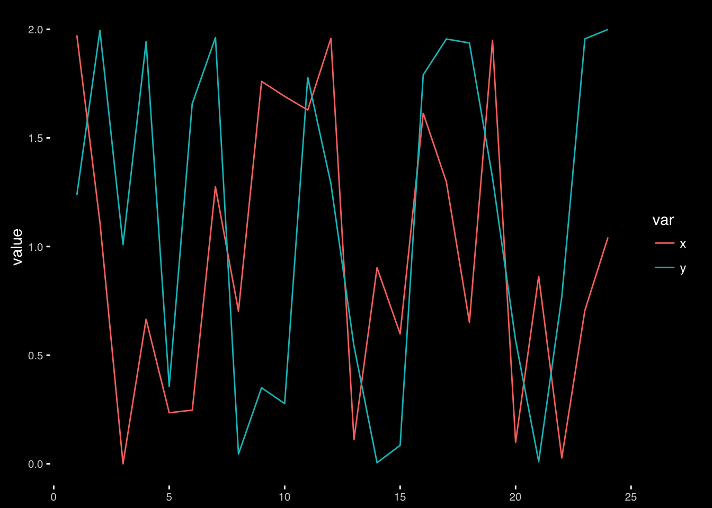

```{r setup, include=FALSE}
knitr::opts_chunk$set(echo = FALSE)
```


John Rauser presents an engaging overview on the topic of good graphical principles, including an excellent demonstration of how to use the Cleveland-McGill ranking in practice. The presentation summarises the human visual system and how we decode visual information. Practical tips are then provided on how to apply this knowledge to design and implement effective statistical graphics. The video can be viewed [online](https://www.youtube.com/watch?v=fSgEeI2Xpdc)

If you are interested in the reproducing the examples presented, a github repository of ggplot code is also [available]( https://github.com/jrauser/writing/blob/master/how_humans_see_data/hhsd_notes.Rmd)

```{r, preview=TRUE, fig.cap = "Example graph from John's presentation."}

```


## Corrections or questions {.appendix}

If you see mistakes, want to suggest changes or even ask us a question, please [create an issue](https://github.com/GraphicsPrinciples/gallery/issues) on the source repository.