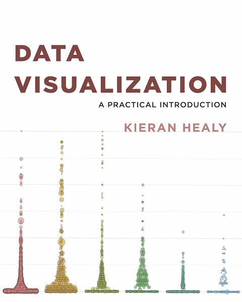

  
```{r setup, include=FALSE}
knitr::opts_chunk$set(echo = FALSE)
```

```{r, preview=TRUE, fig.cap = "Front cover of Data Visualization for Social Science: A practical introduction with R and ggplot2"}

```


Kieran Healy is a professor in sociology at Duke University. He is also an active teacher on the principles of data visualization and now author of a new book on the subject of graphical principles written fully in R Bookdown. His book is an excellent and clear guide for developing effective graphs, starting from the basic principles through to many hands on examples. The book also acts a quick start how to guide for R and ggplot2. 

Although the book is aimed at the social sciences the content of the book and the underlying principles apply to all quantitative disciplines. For example, there is a section dedicated to the presentation of estimates and predictions from a statistical model, covering extensions to ggplot such as GGally.  

An online version of the book is now available at [http://socviz.co/](http://socviz.co/).  


