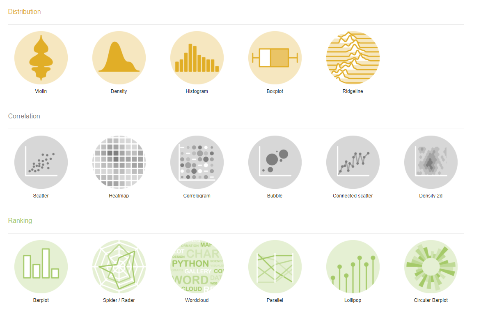

```{r setup, include=FALSE}
knitr::opts_chunk$set(echo = FALSE)
```

The [R graph gallery](https://www.r-graph-gallery.com/index.html) is a great resource for example graphs and charts written in R, with examples also coded in d3 and python. Examples are organised in an intuitive way by the purpose of the comparison. See for yourself at [https://www.r-graph-gallery.com/index.html](https://www.r-graph-gallery.com/index.html).


```{r, fig.cap = "Screenshot of how examples and code are intuitively organised @ https://www.r-graph-gallery.com/index.html."}

```

## Corrections or questions {.appendix}

If you see mistakes, want to suggest changes or even ask us a question, please [create an issue](https://github.com/GraphicsPrinciples/gallery/issues) on the source repository.